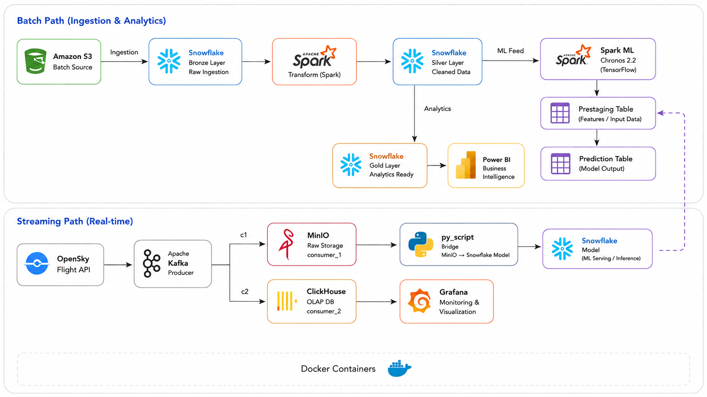

# Sky Eye - ADS-B Flight Intelligence Platform

Sky Eye is an end-to-end ADS-B flight data engineering platform for live aircraft monitoring, historical analytics, and anomaly detection.

The project combines a streaming pipeline for near real-time monitoring and a batch pipeline for historical analytics and machine learning. The platform ingests live and historical ADS-B records, stores raw data, cleans and enriches the data in Snowflake, produces BI-ready star-schema tables, and applies ML-based anomaly scoring.

---

## Business Problem

Live ADS-B flight data arrives at high volume from multiple sources, but without a unified platform it is difficult to:

- Monitor aircraft movement in near real time.
- Detect flight anomalies, steep descents, speed outliers, and data-quality issues.
- Analyze historical traffic trends.
- Build reliable dashboards for operational and business stakeholders.
- Feed machine learning models with clean, trusted features.

Aircraft anomalies, delays, emergencies, and data-quality regressions are rare compared to total traffic, but they can have major operational and financial impact.

---

## Solution Overview

Sky Eye solves this using two connected paths:

### 1. Streaming Path - Real-time

OpenSky Flight API -> Kafka -> Spark Structured Streaming -> MinIO + ClickHouse -> Grafana + Snowflake ML serving.

The streaming path supports:

- Live ADS-B ingestion.
- Kafka-based event streaming.
- Spark parsing and enrichment.
- Raw event storage in MinIO.
- OLAP serving in ClickHouse.
- Real-time Grafana dashboards.
- Bridge into Snowflake ML serving tables.

### 2. Batch Path - Historical Analytics

Historical ADS-B trace archives -> AWS S3 -> Snowflake Bronze -> Silver -> Gold Analytics / Gold ML -> Power BI.

The batch path supports:

- Large-scale historical ADS-B ingestion.
- Raw Bronze trace preservation.
- Silver cleaning, standardization, null handling, and deduplication.
- Gold Analytics star schema.
- Gold ML feature engineering and anomaly scoring.
- Power BI historical reporting.

---

## System Architecture



---

## Tech Stack

| Area | Tools |
|---|---|
| Streaming ingestion | OpenSky API, Apache Kafka |
| Stream processing | Apache Spark Structured Streaming |
| Object storage | MinIO, AWS S3 |
| OLAP serving | ClickHouse |
| Cloud warehouse | Snowflake |
| Warehouse transformation | Snowpark Python, SQL |
| ML | XGBoost, Chronos, TensorFlow |
| Live monitoring | Grafana |
| BI reporting | Power BI |
| Containerization | Docker |

---

## Repository Structure

```text
streaming/       Real-time OpenSky -> Kafka -> Spark -> MinIO/ClickHouse pipeline
batch/           Historical ADS-B archive ingestion into S3 and Snowflake
bronze/          Bronze-layer documentation
silver/          Silver Snowpark cleaning and null-handling logic
gold/analytics/  Gold Analytics star-schema build
gold/ml/         ML feature engineering and anomaly detection pipeline
docs/            Architecture, dashboards, presentation, and data dictionary
dashboards/      Grafana and Power BI notes
notebooks/       Exploration notebooks
```


## Main Outputs

### Streaming Outputs

- MinIO raw Parquet storage.
- ClickHouse `opensky.aircraft_states`.
- Grafana live dashboards.
- Snowflake ML serving feed.

### Batch Outputs

- Snowflake Bronze raw trace tables.
- Snowflake Silver cleaned table.
- Snowflake Gold Analytics star schema.
- Power BI dashboards.
- Gold ML anomaly-scoring tables.

## Snowflake Layers

### Bronze

Stores raw or lightly parsed ADS-B trace records.

### Silver

Creates a clean single source of truth by:

- Standardizing aircraft identity fields.
- Validating callsigns and squawk codes.
- Resolving altitude and vertical-rate fields.
- Removing stale records.
- Dropping redundant/high-null columns.
- Producing `AIRLINES.SILVER.FLIGHT_TRACES_CLEAN`.

### Gold Analytics

Creates BI-ready labels and star-schema tables:

- `DIM_AIRCRAFT`
- `DIM_FLIGHT`
- `DIM_DATE`
- `DIM_TIME`
- `DIM_SQUAWK`
- `DIM_EMERGENCY`
- `DIM_TRACE_FLAGS`
- `FACT_FLIGHT_TRACE`

### Gold ML

Creates ML-ready features and anomaly scores using:

- XGBoost next-state prediction.
- Prediction residuals.
- Category-aware thresholds.
- Episode grouping.
- Chronos sequence validation.
- Hybrid anomaly labels.

## Dashboards

### Grafana

Grafana is used for near real-time operational monitoring.

### Power BI

Power BI is used for historical analytics and executive reporting.

## How to Run

### 1. Clone the repository

```bash
git clone https://github.com/YOUR_USERNAME/sky-eye-adsb-platform.git
cd sky-eye-adsb-platform
```

### 2. Create Python environment

```bash
python -m venv .venv
```

Windows:

```powershell
.venv\Scripts\activate
```

Mac/Linux:

```bash
source .venv/bin/activate
```

### 3. Install dependencies

```bash
pip install -r requirements.txt
```

For ML:

```bash
pip install -r requirements-ml.txt
```

### 4. Create local environment file

Copy `.env.example` to `.env` and fill in your local values.

```bash
cp .env.example .env
```

### 5. Start streaming services

```bash
docker compose -f streaming/docker/docker-compose.yml up -d
```

### 6. Run streaming pipeline

```bash
python streaming/producer_consumer/opensky_kafka_spark_pipeline.py
```

### 7. Run MinIO to Snowflake bridge

```bash
python streaming/bridge/minio_to_snowflake_bridge.py
```

### 8. Run Snowflake transformations

Run scripts in order:

```text
silver/snowpark/01_null_backfill_strategy.py
silver/snowpark/02_transform_silver.py
gold/analytics/build_gold_analytics_star_schema.py
```

## Security Notes

This repository does not include secrets or raw production data.

Never commit:

- `.env`
- Snowflake passwords
- OpenSky credentials
- AWS keys
- MinIO secrets
- ClickHouse passwords
- Raw ADS-B trace files
- Large Parquet or JSON files
- Spark checkpoints
